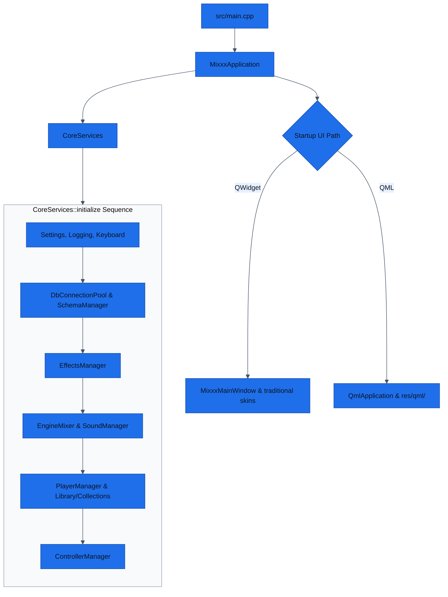
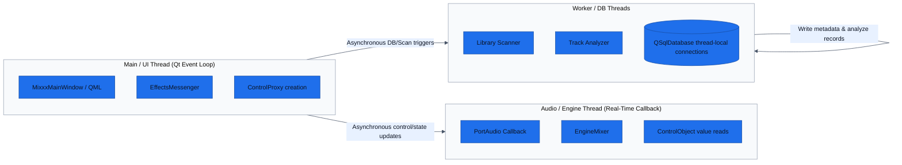

# System Architecture

Doc type: architecture
Owner: current-agent-or-team
Status: active
Last updated: 2026-06-02
Last verified: 2026-06-02
Verified against: src/main.cpp, src/coreservices.cpp, src/control/controlobject.h, res/schema.xml
Confidence: high
Canonical source: `docs/architecture.md`
Related docs: `README.md`, `data-model.md`, `testing-strategy.md`, `decision-log.md`

This document defines the runtime composition, subsystem boundaries, threading models, and key architectural choices of the Mixxx codebase.

---

## Runtime Shape and Initialization Sequence

### 1. Application Entrypoint (`src/main.cpp`)
Application startup begins in `main()`, which:
- Performs early environment initialization (scaling, Qt options).
- Parses command-line arguments.
- Instantiates `MixxxApplication`.
- Determines the UI path: either `mixxx::qml::QmlApplication` (experimental QML path) or `MixxxMainWindow` (traditional skin-based path).
- Enters the main Qt event loop.

### 2. Composition Root (`mixxx::CoreServices`)
The orchestrator of the Mixxx runtime is `mixxx::CoreServices`. It is responsible for constructing, initializing, and finalizing all major application-level services in a strict, deterministic sequence.

### Teardown Sequence (`CoreServices::finalize`)
Services are destroyed in the reverse order of initialization to avoid resource leaks, database locks, or invalid references between objects during application shutdown.

---

## Subsystem Boundaries

| Subsystem | Responsibility | Core Interfaces / Files |
| --- | --- | --- |
| **Application Shell** | CLI arg parsing, Qt context, main loop execution, top-level UI startup routing. | `src/main.cpp`, `src/mixxxapplication.cpp` |
| **Composition Root** | Orchestrates startup, dependency wiring, and shutdown ordering of subsystems. | `src/coreservices.h`, `src/coreservices.cpp` |
| **Control Bus** | Inter-component signaling and key-value state store spanning UI, audio, and controller threads. | `src/control/controlobject.h`, `src/control/controlproxy.h` |
| **Audio Engine** | Real-time audio signal routing, deck/player synthesis, mixing, and PortAudio integrations. | `src/engine/`, `src/soundio/` |
| **Library & Collection** | Handles track metadata index, local filesystem scans, collections, and playlist models. | `src/library/`, `src/track/` |
| **Controller Layer** | Maps physical MIDI/HID inputs to control bus commands, executes JavaScript mappings. | `src/controllers/`, `res/controllers/` |
| **UI Presentation** | Parallel presentation paths spanning legacy QWidgets (skins) and new QML engine components. | `src/qml/`, `res/qml/`, `src/widget/` |
| **Persistence** | Local flat config storage and SQLite-backed user database manager. | `src/database/`, `res/schema.xml`, `src/preferences/` |

---

## Threading Models and Real-Time Safety

To ensure glitch-free audio performance, the Mixxx runtime divides operations across multiple threads with explicit constraints:

### 1. Main / UI Thread
- Hosts the standard Qt event loop.
- Performs QWidget skin drawing, QML rendering, and controller JavaScript execution.
- Interacts with the control bus via `ControlProxy`.
- Allocation of memory, file I/O, and UI-blocking tasks are confined to this thread or worker threads.

### 2. Audio Engine Thread (Real-Time)
- Serves low-latency callbacks (e.g., via PortAudio) at high runtime priority.
- **Strict Constraint**: No heap allocations, no blocking mutex locks, no GUI interactions, and no direct file I/O are permitted.
- Control inputs are read from the thread-safe `ControlObject` bus.
- Thread-safe queues or message patterns (like `EffectsMessenger`) are used to defer allocating operations to the main thread.

### 3. Database and Background Worker Threads
- The library scanner, track analyzer, and external-library synchronizers run in separate worker threads.
- Subsystems instantiate thread-local database connections from the pooled `DbConnectionPool` to avoid thread contention.

---

## Architectural Challenges & Coexistence

- **Dual UI Layer**: The coexistence of the legacy skin engine and the modern QML engine requires dual-registering properties and ensuring the control bus acts as a unified abstraction layer.
- **In-Tree Resource Assets**: Critical application logic is split between C++ files, JavaScript mappings (`res/controllers/`), QML components (`res/qml/`), and the XML database schema (`res/schema.xml`). Changes to physical behavior must check these resource paths first.
