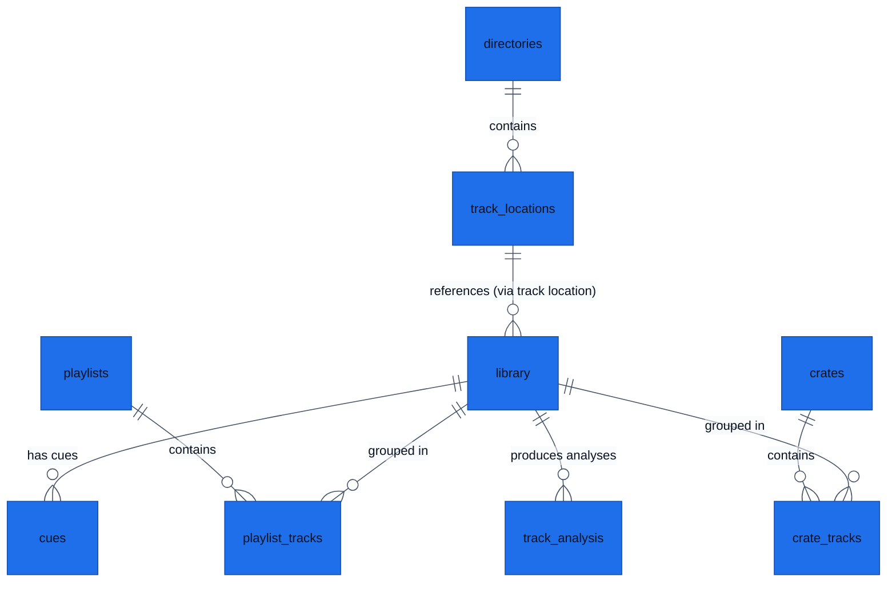

# Data Model and Domain Persistence

Doc type: data-model
Owner: current-agent-or-team
Status: active
Last updated: 2026-06-02
Last verified: 2026-06-02
Verified against: res/schema.xml, src/track/track.h, src/track/trackrecord.h, src/library/trackcollectionmanager.h
Confidence: high
Canonical source: `docs/data-model.md`
Related docs: `README.md`, `architecture.md`, `decision-log.md`

This document outlines the persistence surfaces, core SQL tables, domain entities, and collection management architecture used in Mixxx.

---

## Persistence Surfaces

### 1. Application Preferences (`mixxx.cfg`)
- **Format**: Flat configuration file.
- **Access**: Managed via `ConfigObject` and `SettingsManager`.
- **Purpose**: Stores local device settings, keyboard shortcuts, folder paths, and UI configuration parameters.

### 2. Main Music Library (`mixxxdb.sqlite`)
- **Format**: SQLite 3 database file.
- **Access**: Thread-local database handles pooled via `DbConnectionPool`.
- **Schema Management**: Controlled by `SchemaManager` which reads the database schema dynamically from `res/schema.xml` (compiled into the Qt resource system as `:/schema.xml`).
- **Schema Version**: Required database schema version is **`40`**.

---

## Core SQL Schema Overview (`res/schema.xml`)

Mixxx organizes library metadata, tracks, and performance data into several structured tables:

| Table Name | Description | Key Schema Columns |
| --- | --- | --- |
| `directories` | Registered filesystem search directories. | `directory`, `active` |
| `track_locations` | Unique file references and location states. | `id`, `location`, `fs_created`, `fs_modified`, `verified` |
| `library` | Primary track metadata store. | `id`, `location` (FK), `artist`, `title`, `bpm`, `duration`, `rating`, `playcount`, `bpm_lock` |
| `cues` | Cues, hotcues, and performance loops. | `id`, `trackId` (FK), `position` (audio frame), `type`, `label`, `hotcue` |
| `playlists` | Metadata headers for user-created playlists. | `id`, `name`, `date_created`, `locked` |
| `playlist_tracks` | Many-to-many playlist tracking order map. | `playlist_id` (FK), `track_id` (FK), `position` |
| `crates` | User-defined grouping crates. | `id`, `name`, `locked`, `autodj` |
| `crate_tracks` | Many-to-many crate tracking mapping. | `crate_id` (FK), `track_id` (FK) |
| `track_analysis` | Cached analysis artifacts (beat grids, waves). | `track_id` (FK), `type`, `version`, `checksum`, `data` |
| `itunes_*`, `traktor_*` | Integration sync caches. | Various cached library columns from external tools. |

---

## Domain Entity Classes

The C++ code maps database tables to rich domain objects that coordinates memory caching, UI signal propagation, and real-time execution safety.

### 1. `mixxx::TrackRecord`
Represents the database-persisted footprint of a track.
- **Fields**: Identity (`TrackId`), metadata (`TrackMetadata`), file info (type, filesystem URL), play counts, ratings, and performance offsets (bpm, tuning frequency, main cue position).
- **Location**: `src/track/trackrecord.h`

### 2. `Track` (In-Memory Subsystem)
The main domain model wrapper representing a track loaded into runtime memory.
- **Capabilities**:
  - Encapsulates `TrackRecord`.
  - Maintains cues lists, beat grids, waveform profiles, and analyses summaries.
  - Implements Qt property bindings (`Q_PROPERTY`) for UI/QML synchronization.
  - Implements dirty-flag tracking to flush modified user tags/metadata to the SQLite DB asynchronously.
- **Location**: `src/track/track.h`

### 3. `TrackDAO` (Data Access Object)
Encapsulates low-level database statements (reads/writes) for tracks.
- **Capabilities**: Resolving unique track locations, executing track insertion/update commands, managing track deletion/hiding/purging sequences, and checking cover art matches.
- **Location**: `src/library/dao/trackdao.h`

### 4. `TrackCollectionManager`
Coordinates user collection boundaries across internal database structures and external integration surfaces (such as iTunes, Traktor, Rhythmbox, or Rekordbox).
- **Responsibilities**: Triggers filesystem scanner tasks, routes directory adjustments, and synchronizes track modifications across multiple local/external collection backends.
- **Location**: `src/library/trackcollectionmanager.h`

---

## Collection Coexistence Philosophy

Mixxx maintains internal music library tables completely separate from external tool sync maps (e.g. iTunes, Traktor, Rekordbox). Database operations targeting external playlists, crates, or tracks are executed using distinct schema views (`itunes_*` tables in `res/schema.xml`), which avoids polluting core application metadata.
