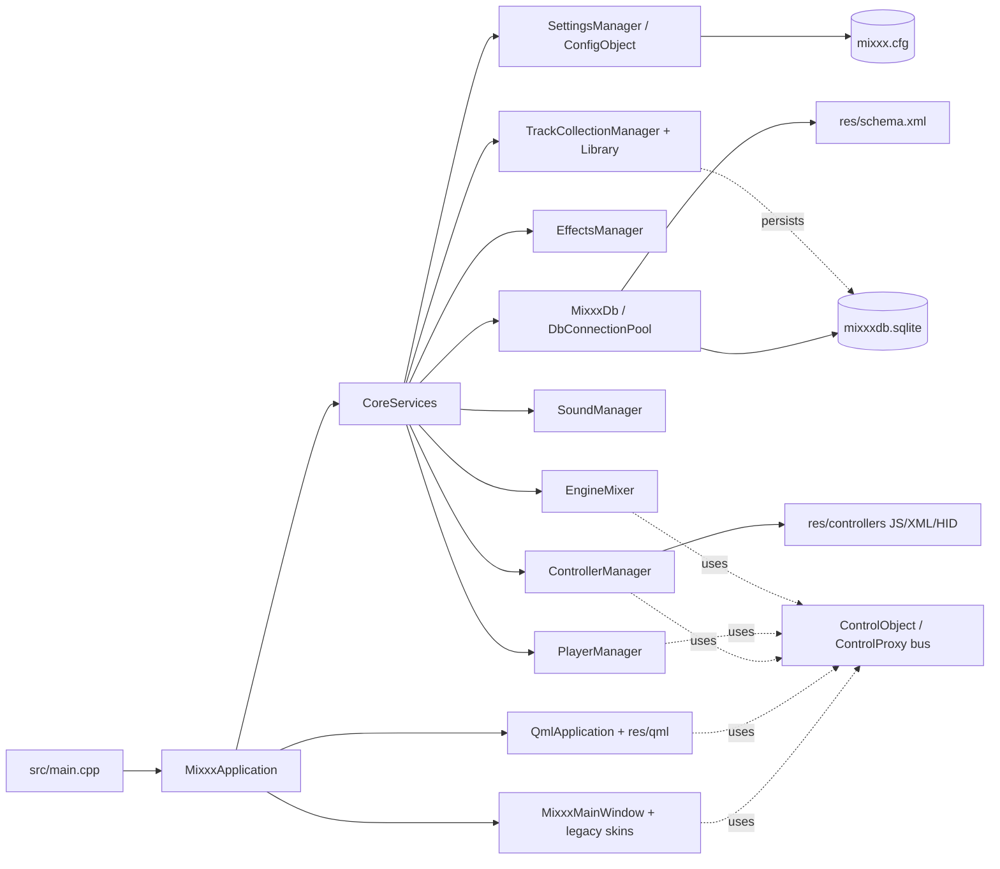

# Inferred architecture

This document reconstructs the current architectural shape of the repository
from code and configuration. It is **not** a maintainer-approved architecture
specification.

## Confirmed runtime shape

1. `src/main.cpp` performs early application setup, parses command-line
   arguments, creates `MixxxApplication`, and then chooses one of two startup
   paths:
   - QML path via `mixxx::qml::QmlApplication`
   - traditional path via `MixxxMainWindow`
2. `mixxx::CoreServices` performs the main dependency composition and ordered
   runtime initialization.
3. `CoreServices::initialize()` constructs the major service graph in this
   general sequence:
   - settings / logging / translations / keyboard
   - database connection pool and schema initialization
   - effects manager
   - engine mixer
   - sound manager
   - recording / broadcast / vinyl control (conditional)
   - player manager
   - library and track collection manager
   - controller manager
4. `CoreServices::finalize()` tears these down in a deliberate order to avoid
   leaks, dangling pointers, or invalid cross-subsystem references.

## Inferred subsystem boundaries

| Subsystem | Role | Evidence | Confidence |
| --- | --- | --- | --- |
| Bootstrap / application shell | Owns command-line parsing, Qt app creation, style/scaling, top-level startup decision. | `src/main.cpp` | High |
| Composition root | Owns construction order, dependency wiring, and shutdown order for major services. | `src/coreservices.cpp`, `src/coreservices.h` | High |
| Control bus | Provides group/key-addressed shared controls and signals between otherwise separate components. | `src/control/controlobject.h`, `src/control/controlproxy.h` | High |
| Audio engine | Owns low-latency audio processing, effects processing, device callbacks, and player signal path. | `src/engine/`, `src/soundio/sounddeviceportaudio.cpp`, `src/coreservices.cpp` | High |
| Library / collection layer | Owns internal library DB state, scanners, track resolution, caches, playlists/crates, and external collection synchronization. | `src/library/trackcollectionmanager.h`, `src/library/dao/trackdao.h`, `src/track/track.h` | High |
| Controller subsystem | Owns hardware integration, mapping definitions, JS execution, and controller-facing APIs. | `src/controllers/`, `src/controllers/scripting/controllerscriptenginebase.h`, `res/controllers/` | High |
| UI layer | Split between legacy QWidget/skin path and newer QML path. | `src/main.cpp`, `src/qml/qmlapplication.cpp`, `res/qml/` | High |
| Persistence layer | Split between `mixxx.cfg` style settings/config and `mixxxdb.sqlite` schema-backed library storage. | `src/main.cpp`, `src/database/mixxxdb.cpp`, `res/schema.xml` | High |

## Architecture sketch

## Threading and runtime discipline

### Main / UI thread

- `ControlProxy` instances are expected to be created and destroyed from the
  same thread.
- `EffectsMessenger` is explicitly documented as a main-thread component that
  sends requests to the audio side and processes responses there to avoid heap
  work in the audio thread.
- The traditional UI path and QML UI path are both rooted in the main Qt event
  loop.

### Audio / engine thread

- `ControlObject::connectValueChangeRequest()` documents that engine objects
  may require `Qt::DirectConnection` because the audio thread has no Qt event
  queue.
- `EffectsMessenger` exists specifically to keep allocation/deallocation away
  from the audio thread.
- The PortAudio callback path attempts to run at real-time priority and treats
  underruns as significant runtime events.

### Database / worker activity

- `CoreServices` creates a DB connection pool and a thread-local connection for
  the main thread.
- Code paths such as analyzer and library scanner logic use pooled DB
  connections, which strongly suggests multi-threaded DB access through cloned
  or pooled `QSqlDatabase` handles.

## Notable architectural tensions

### Dual UI stack

The repository currently appears to support both:

- a traditional QWidget / `MixxxMainWindow` / skin-driven path
- a QML application path with dedicated QML plugins, singleton registration,
  and a separate startup object

This likely increases migration complexity, testing surface, and ownership
ambiguity for future docs.

### Resource-heavy in-tree product surface

Mixxx is not “just” C++ sources. Important behavior is distributed across:

- controller mapping XML/HID/MIDI descriptors
- controller JS scripts
- QML assets
- packaged schema resources
- packaging and platform scripts

Future architecture docs should treat these as first-class artifacts.

## Review questions for maintainers

- Is `CoreServices` intended to remain the long-term composition root?
- What is the target boundary between legacy UI and QML UI?
- Which controller APIs are considered stable contracts versus internal glue?
- Are external library integrations part of the architecture core or adjunct
  features with weaker support guarantees?