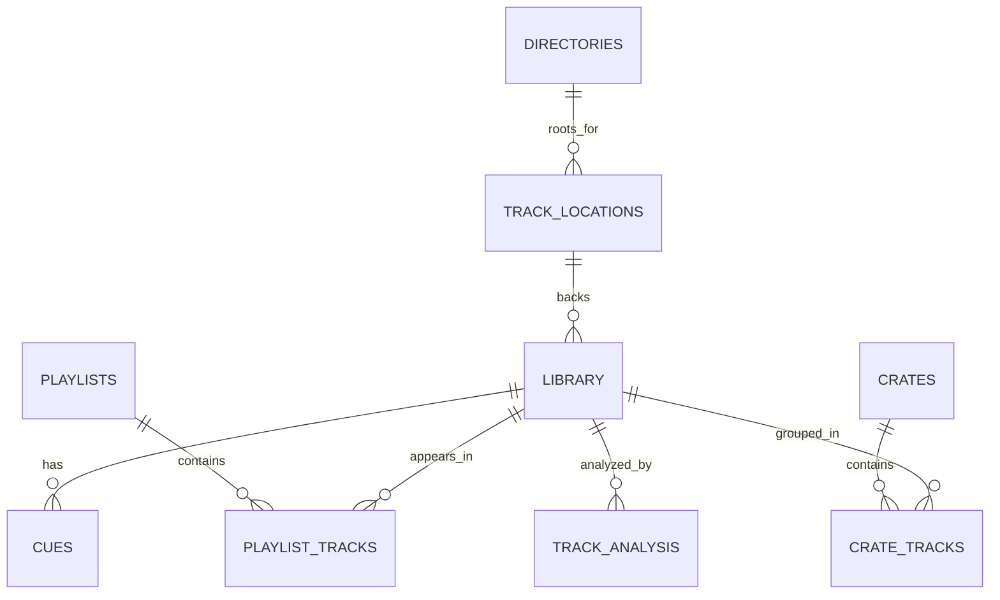

# Inferred data model

This file summarizes the persistence and domain model that could be recovered
from repository evidence. It should be reviewed against the live application
and maintainer expectations before promotion.

## Persistence surfaces

### Settings / config file

- File name: `mixxx.cfg`
- Purpose: stores preferences/configuration via `ConfigObject` and
  `SettingsManager`
- Evidence: `src/config.h.in`, `src/main.cpp`, `src/preferences/settingsmanager.h`

### Main database

- File name: `mixxxdb.sqlite`
- Database type: SQLite (`QSQLITE`)
- Connection mode: per-profile DB path, pooled/cloned connections via
  `DbConnectionPool`
- Schema source: embedded Qt resource `:/schema.xml` backed by `res/schema.xml`
- Required schema version at intake time: `40`
- Evidence: `src/database/mixxxdb.cpp`, `src/database/mixxxdb.h`,
  `src/database/schemamanager.h`, `res/schema.xml`

## Key persisted tables recovered from `res/schema.xml`

| Table | Apparent role | Evidence |
| --- | --- | --- |
| `settings` | DB-backed settings/metadata cache used by schema and other subsystems. | `res/schema.xml`, `src/database/schemamanager.h` |
| `track_locations` | Stores file path/location facts and verification/deletion state for tracks. | `res/schema.xml` |
| `library` | Main internal track metadata table with user-visible metadata, analysis-related fields, play state, cover art, color, key/BPM, sync timestamps, tuning, etc. | `res/schema.xml`, `src/track/trackrecord.h` |
| `Playlists` | Playlist headers/metadata. | `res/schema.xml` |
| `PlaylistTracks` | Playlist membership and position/history timing. | `res/schema.xml` |
| `cues` | Per-track cue/hotcue records including type, position, length, label, and color. | `res/schema.xml`, `src/track/track.h` |
| `crates` | Crate/grouping records, including lock/autodj-related state. | `res/schema.xml` |
| `crate_tracks` | Many-to-many crate membership table. | `res/schema.xml` |
| `track_analysis` | Analysis artifact records keyed to tracks with type/version/checksum metadata. | `res/schema.xml` |
| `directories` | Registered library root directories. | `res/schema.xml` |
| `itunes_*`, `traktor_*`, `rhythmbox_*` | External-library integration tables. | `res/schema.xml` |

## Core domain objects visible in code

### `mixxx::TrackRecord`

`TrackRecord` appears to represent the DB-backed portion of track state.

Recovered properties include:

- identity: `TrackId`
- metadata: `TrackMetadata`
- synchronization: `sourceSynchronizedAt`
- cover art: `CoverInfoRelative`
- file info facets: type / URL
- playback/user data: `PlayCounter`, rating, color
- DJ-specific state: `mainCuePosition`, BPM lock, keys, tuning frequency

Evidence:

- `src/track/trackrecord.h`

### `Track`

`Track` appears to be the richer in-memory/domain object layered over a file
reference plus `TrackRecord`.

Additional state visible in `Track` includes:

- cue list
- beat grid / beats pointer
- waveform and waveform summary
- dirty/clean lifecycle
- metadata-export flag
- Qt property notifications for UI/controller bindings

Evidence:

- `src/track/track.h`

### `TrackCollectionManager`

`TrackCollectionManager` appears to coordinate:

- the internal collection
- external collections
- track resolution by ID / reference / URL / location
- directory add/remove/relocate operations
- auto-scan and scan lifecycle
- synchronized modifying operations that affect multiple collections

Evidence:

- `src/library/trackcollectionmanager.h`

### `TrackDAO`

`TrackDAO` appears to own the lower-level DB interaction for tracks, including:

- resolving track IDs from file paths/URLs
- loading tracks
- adding/updating tracks
- hide/unhide/purge flows
- scan-related verification and cover-art detection

Evidence:

- `src/library/dao/trackdao.h`

## Data model sketch

This ER diagram is intentionally conservative. The exact foreign-key behavior
and runtime invariants should be confirmed from DAO implementations and live DB
inspection before canonicalization.

## External collection model

Recovered evidence suggests Mixxx keeps the internal collection separate from
external integrations rather than flattening everything into the main internal
`library` table.

Evidence:

- `src/library/trackcollectionmanager.h` exposes internal and external
  collections separately.
- `res/schema.xml` defines dedicated `itunes_*`, `traktor_*`, and
  `rhythmbox_*` tables.
- code search also surfaced Rekordbox-specific DB/table logic in feature code,
  suggesting some integrations may create runtime tables or temporary views.

Confidence: medium.

## Data-model observations worth carrying forward

- Track persistence is split between file-system facts, user/library metadata,
  cue/playlist/crate membership, and analysis artifacts.
- The domain model is richer than the DB schema alone; canonical docs should
  distinguish persisted properties from computed/session/runtime state.
- Some migration history remains visible directly in `res/schema.xml`, so the
  schema file doubles as both current structure and historical evolution log.

## Unknowns to resolve before promotion

- Exact stable relationship model between `track_locations` and `library`.
- Whether all external-library tables are still strategic and actively used.
- Which fields are considered public/stable enough to document as contracts for
  controller scripts, QML, or external tooling.
- Whether analysis artifacts outside `track_analysis` are persisted elsewhere or
  derived on demand.