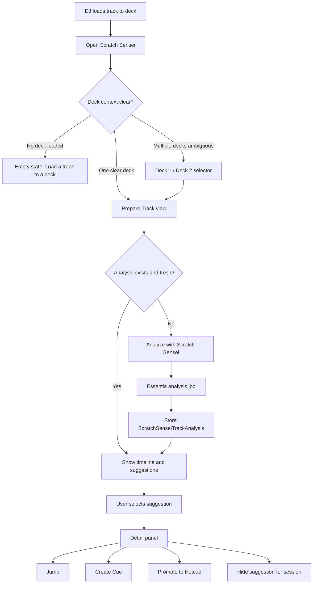
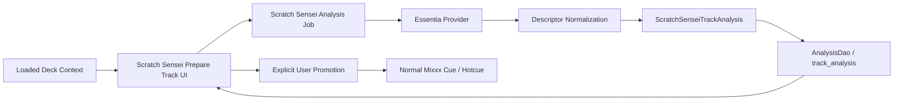
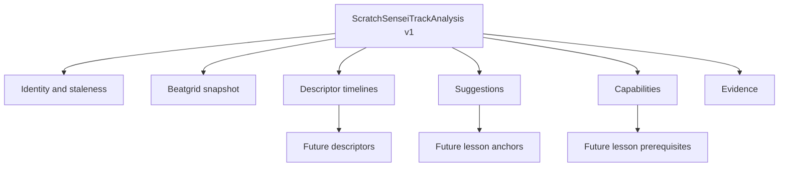
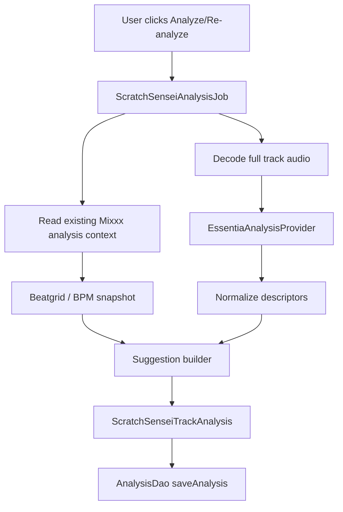
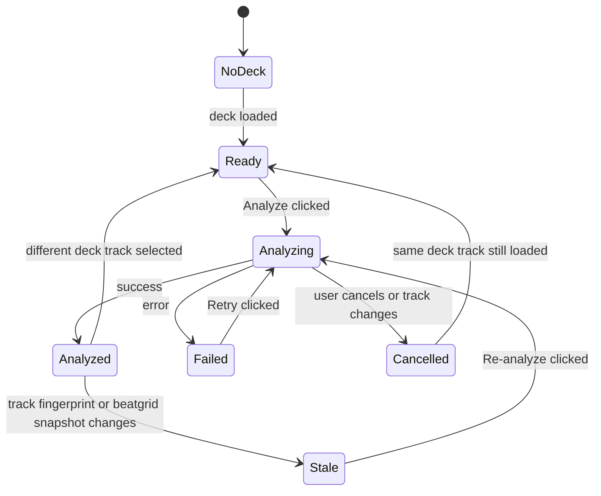
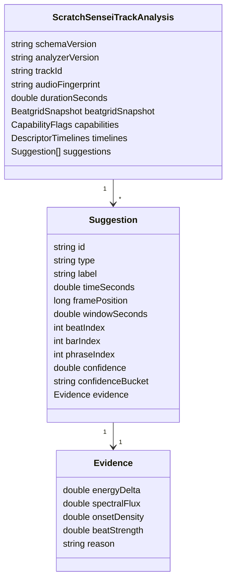
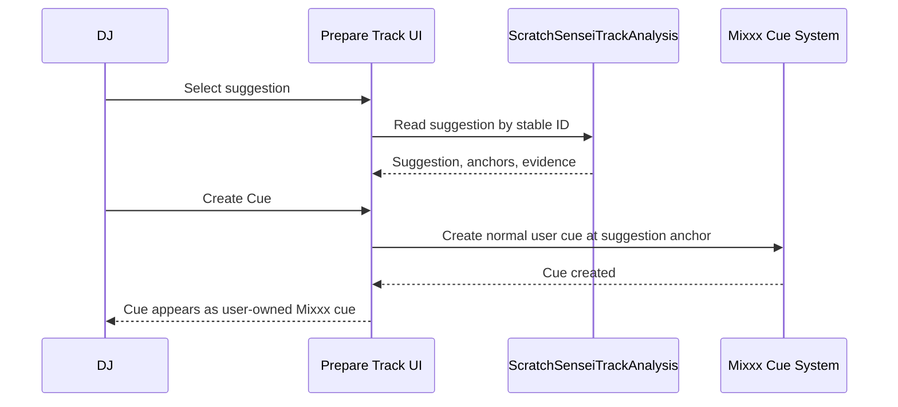
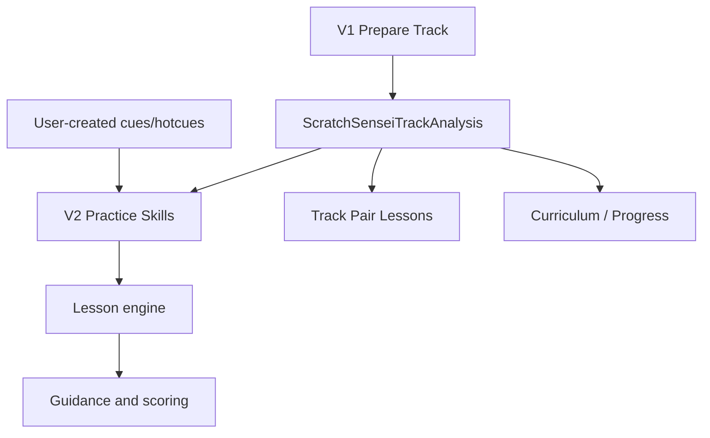

# Scratch Sensei V1 Design

Doc type: feature-design
Status: draft-for-review
Owner: current-agent-or-team
Last updated: 2026-06-07
Last verified: 2026-06-07
Verified against: `docs/superpowers/plans/scratch-sensei/spec.md`
Confidence: medium
Canonical source: `docs/superpowers/plans/scratch-sensei/design.md`
Related docs: [`spec`](./spec.md), [`feature`](../../../features/scratch-sensei.md), [`ADR 0002`](../../../adr/0002-scratch-sensei-required-essentia.md), [`ADR 0003`](../../../adr/0003-scratch-sensei-v1-scope.md), [`ADR 0004`](../../../adr/0004-scratch-sensei-analysis-summary-only.md)

This design expands the V1 spec into flows, states, visual layout, and boundaries.

---

## Design Principles

- **One job first:** V1 helps the DJ inspect one loaded deck track.
- **Trust over magic:** Scratch Sensei suggests; the user decides.
- **No hidden cue writes:** analysis output stays out of Mixxx cue rows until explicit user promotion.
- **Visual first:** the timeline should explain the track faster than a table.
- **Training-ready contract:** V1 does not build lessons, but its analysis artifact should be useful for future lessons.

---

## Product Flow



---

## System Data Flow



Key rule: only **Explicit User Promotion** writes to Mixxx cues.

---

## Track Analysis Storage Plan

Scratch Sensei should reuse Mixxx's existing analysis cache surface:

- Table: `track_analysis`
- DAO: `AnalysisDao`
- Payload storage: compressed analysis data stored through `AnalysisDao::saveAnalysis`
- New analysis type: `TYPE_SCRATCHSENSEI_TRACK_ANALYSIS`
- Payload: versioned `ScratchSenseiTrackAnalysis`

Do not add a Scratch Sensei-specific SQL table in V1.

Why:

- `track_analysis` already stores per-track binary analysis artifacts.
- It already supports `type`, `description`, `version`, checksum, and external compressed payload files.
- It keeps Scratch Sensei aligned with waveform and wave summary caching.
- It avoids schema churn while leaving payload evolution to the serialized contract.

Suggested storage metadata:

| Field | Value |
| --- | --- |
| `track_id` | Loaded deck track ID |
| `type` | `TYPE_SCRATCHSENSEI_TRACK_ANALYSIS` |
| `description` | `Scratch Sensei Track Analysis` |
| `version` | Schema version plus analyzer version, e.g. `scratch-sensei-v1:essentia-<version>` |
| `data` | Serialized `ScratchSenseiTrackAnalysis` |

When re-analysis succeeds, replace the existing Scratch Sensei analysis for the same track/type. Re-analysis should not delete other analysis types.

---

## Existing Analysis Inputs

Scratch Sensei should not duplicate every Mixxx analysis result. It should use existing data where it is the source of truth and store only the snapshot needed to explain its own result.

| Existing data | V1 use | Requirement level | Store in `ScratchSenseiTrackAnalysis`? |
| --- | --- | --- | --- |
| Source audio decoded for Essentia | Primary MIR source for energy, onset, timbre, and section evidence | Required | Store analyzer version, descriptor summaries, and staleness key |
| Track ID, duration, location/fingerprint inputs | Identity and staleness | Required | Store identity/staleness key |
| Beatgrid / BPM | Musical anchors for suggestions | Required for phrase/bar-anchored suggestions; not required for raw descriptor timelines | Store snapshot/version/availability, not a replacement beatgrid |
| Key | Future harmonic lessons | Optional context | Optional capability only; do not require for V1 |
| ReplayGain / EBU R128 | Loudness context if available | Optional context | Optional descriptor reference; Essentia still computes V1 descriptors |
| Waveform / wave summary | Coarse band-energy context and UI alignment | Optional context | Optional cross-check/reference only; do not require as an analysis prerequisite |
| Cues / hotcues | User intent and promotion output | Optional context | Read for display context only; never write unless user promotes |

Design rule: existing Mixxx analysis data can provide prerequisites and anchors. Essentia provides the Scratch Sensei descriptor timelines and suggestions.

If beatgrid is missing or stale, V1 should not silently invent phrase anchors. It can still show descriptor evidence, but phrase/bar-linked suggestions should be unavailable or marked low confidence.

The waveform cache is useful, but it should not decide whether Scratch Sensei can analyze a track. Mixxx waveform data is a visual-resolution summary of amplitude and filtered low/mid/high bands; skins may render that as colored waveform information. That makes it valuable for aligning markers to what the user sees and for cheap cross-checks, but it is too coarse to replace source-audio MIR descriptors such as onset density, spectral flux, segment novelty, and confidence evidence.

The key result should be read as optional existing context, not recomputed or required in V1. Harmonic training can depend on key later, but V1 analysis should still work on tracks where key analysis is absent, disabled, stale, or not relevant to the requested suggestion.

Scratch Sensei should not overwrite Mixxx's default BPM, beatgrid, key, ReplayGain, waveform, or silence analysis in V1. If Essentia disagrees with those values, record the disagreement as Scratch Sensei evidence inside `ScratchSenseiTrackAnalysis` rather than changing the default analysis result.

---

## Analysis Contract Evolution



V1 should make payload evolution cheap:

- Add fields inside the serialized payload rather than new SQL columns.
- Keep unknown future fields ignorable.
- Version the schema and analyzer separately.
- Store descriptor timelines by stable names so future descriptors can be added without changing UI assumptions.
- Keep raw Essentia names behind a provider boundary; the contract should use Scratch Sensei terms.

---

## Analyzer Integration Strategy

V1 should be implemented as a Scratch Sensei analysis job that uses Mixxx analyzer infrastructure where practical.

Recommended shape:



Implementation choices to decide during planning:

- Whether `ScratchSenseiAnalysisJob` is an `Analyzer` registered in `AnalyzerThread` or a separate worker job that reuses the same audio decode patterns.
- How the UI triggers a manual job without making Scratch Sensei run as an automatic background surprise.
- How progress/cancellation are reported back to the Prepare Track UI.

Hard constraints:

- Run Essentia work off the UI thread.
- Never run Essentia work on the real-time audio engine thread.
- Do not block deck playback.
- Use thread-local database access like other analyzer code.

---

## Analysis Job States



Design implications:

- Analysis should be modeled as a job, even if V1 only starts it manually.
- The job needs progress, failure, cancellation, and stale states.
- Track changes during analysis should cancel or invalidate the result.

---

## Prepare Track Layout

```text
+--------------------------------------------------------------+
| Scratch Sensei                                               |
| Deck 1: Artist - Track Title             [Analyze/Re-analyze] |
| Status: analyzed with Essentia • 12 suggestions • Strong mix |
+--------------------------------------------------------------+
|                                                              |
|  Energy                                                      |
|    /\        /\               /^^^^\                         |
|   /  \______/  \______/^^^^\_/      \____                    |
|                                                              |
|  Timeline                                                    |
|  | Intro | Build | Possible drop | Breakdown | Outro |       |
|          ^ maybe phrase change      ^ strong energy dip       |
|                                                              |
+--------------------------------------------------------------+
| Selected suggestion                                          |
| Possible drop • 01:23 • Strong                              |
| Evidence: energy lift + onset density increase               |
| [Jump] [Create Cue] [Promote to Hotcue] [Hide]               |
+--------------------------------------------------------------+
```

Layout rules:

- Header always shows deck and track identity.
- Empty/loading/error states occupy the timeline area, not a modal.
- Suggestion details appear in one fixed panel below the timeline.
- `Create Cue` is primary; `Promote to Hotcue` is secondary.
- Avoid tables in V1.

---

## User-Facing States

| State | UI message | Primary action |
| --- | --- | --- |
| No deck | Load a track to a deck to use Scratch Sensei. | None |
| Ambiguous deck | Choose which loaded deck to inspect. | Deck 1 / Deck 2 |
| Not analyzed | Scratch Sensei has not analyzed this track yet. | Analyze with Scratch Sensei |
| Analyzing | Listening for structure, energy, and phrase clues. | Cancel |
| Analyzed | Suggestions are ready for review. | Select suggestion |
| Stale | Track or beatgrid changed since analysis. | Re-analyze |
| Failed | Scratch Sensei could not analyze this track. | Retry |

---

## Suggestion Model

Each suggestion is a reviewable musical clue.



Training-platform reserve:

- Future lessons can reference suggestion IDs.
- Future lessons can gate on capability flags.
- Future lessons can explain why a moment matters using evidence fields.
- Future two-track lessons can compose two `ScratchSenseiTrackAnalysis` artifacts.

---

## Promotion Flow



Promotion rules:

- Analysis remains unchanged.
- Cue is normal Mixxx user intent.
- Re-analysis does not remove promoted cues.
- Hotcue promotion must be explicit because hotcue slots are performance decisions.

---

## Future Training Platform Path



V1 must not build the lesson engine. It must create the analysis contract that makes the lesson engine possible.

---

## Design Non-Goals

- No Practice Skills tab.
- No lesson scoring.
- No generated cue rows.
- No export.
- No automatic deck control.
- No hidden writes to user cue data.
- No dependency from future lessons to Prepare Track widgets.
